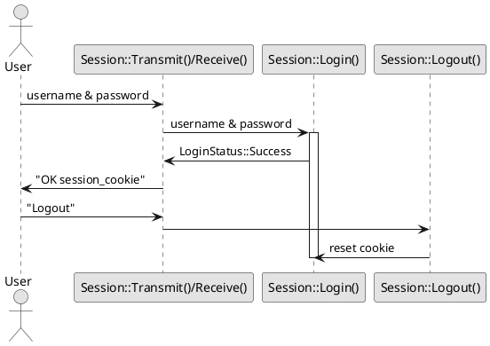

# OSI Stack

[](https://travis-ci.org/mihaigalos/osi_stack) [](https://codecov.io/gh/mihaigalos/osi_stack) [](LICENSE) [](http://hits.dwyl.com/mihaigalos/osi_stack) [](https://github.com/Aaronepower/tokei)


Very rough model of an ISO/OSI communication stack.

This implementation intentionally uses raw pointers instead of smart pointers.

The reasoning is that it will be ported to small 8-bit hardware architectures such as AVR/Arduino, with limited support for modern C++.


.")

### Build and Test

First, get the sources:
```
git clone https://github.com/mihaigalos/osi_stack.git && cd osi_stack
```

#### Baremetal

Building and testing is managed by `bazel`, including dependencies to other repos such as [containers](https://github.com/mihaigalos/containers) (transparent to the end-user).

```bash
bazel build //...
bazel test //...
```

#### Using Docker

```bash
docker run -it --rm -v $(pwd):/src -v /tmp:/tmp/bazel remoteapistesting/bazel-build /bin/bash -c "bazel --output_base=/tmp/bazel test //..."
```

#### Session Layer Authentification

The following code is a PlantUML diagram.

